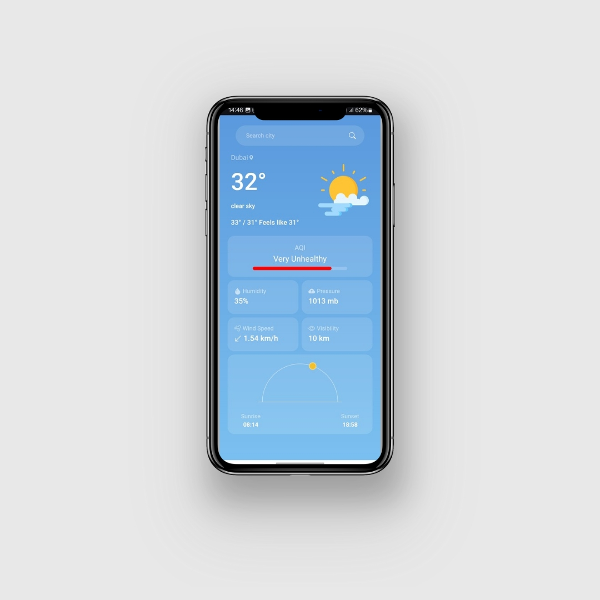
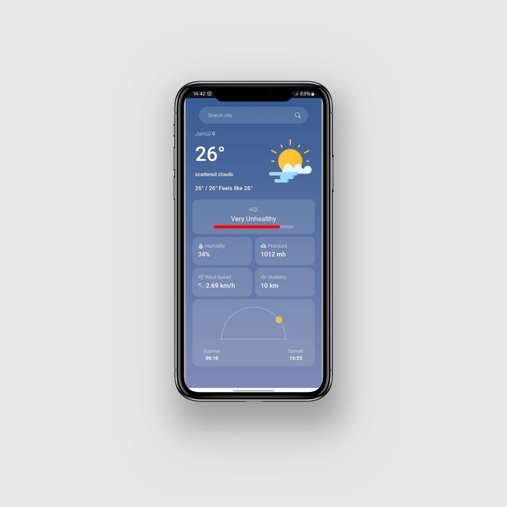
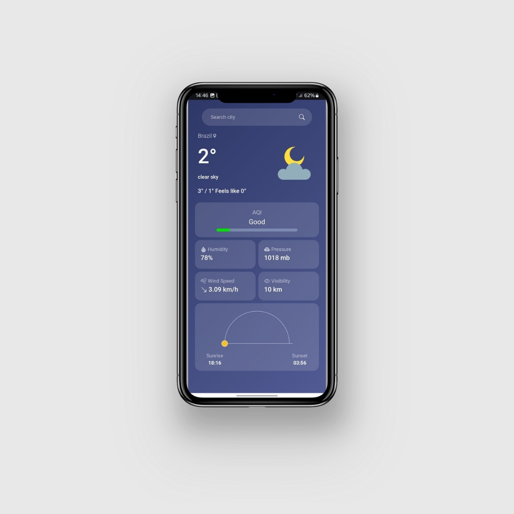

# Weather App

A feature-rich weather application built using React, Tailwind CSS, and Vite. This app provides real-time weather updates, along with dynamic visuals and themes based on the time of day and sun position.

## Features

- Real-time weather updates for any city.
- Displays sunrise, sunset, and current sun position.
- Changes background theme based on morning, day, evening, and night.
- Dynamic weather icons and animations.
- Responsive design for all devices.
- Search functionality for weather data by city.
- Saves the last fetched city's weather data for quicker access.


## Tech Stack


## Usage

1. Enter the name of a city in the search bar.
2. View real-time weather data, including temperature, humidity, wind speed, sunrise, sunset, and sun position.
3. Observe dynamic background changes based on the time of day (morning, day, evening, night).
4. Enjoy the clean and responsive interface.

## Preview


## Dynamic Themes based on time

### Morning 


### Afternoon 



### Evening 



### Night



## Installation

Follow these steps to set up the project locally:

1. Clone the repository:
   ```bash
   git clone https://github.com/techiuv/weather-app.git
   ```

2. Navigate to the project directory:
   ```bash
   cd weather-app
   ```

3. Install dependencies:
   ```bash
   npm install
   ```

4. Start the development server:
   ```bash
   npm run dev
   ```

5. Open your browser and go to:
   ```
   http://localhost:5173
   ```

## Deployment

To deploy the app:

1. Build the project:
   ```bash
   npm run build
   ```

2. Preview the Deployment
   ```bash
   npm run preview
   ```

## API Integration

This app uses a weather API to fetch real-time data. Configure your API key in the `.env` file:

**Replace with your actual API key:**
```env
VITE_OPEN_WEATHER_API=YOUR_API_KEY
```

## License

This project is licensed under the [MIT License](LICENSE).
